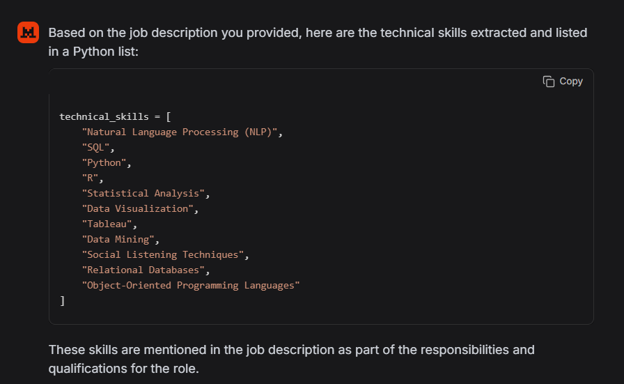
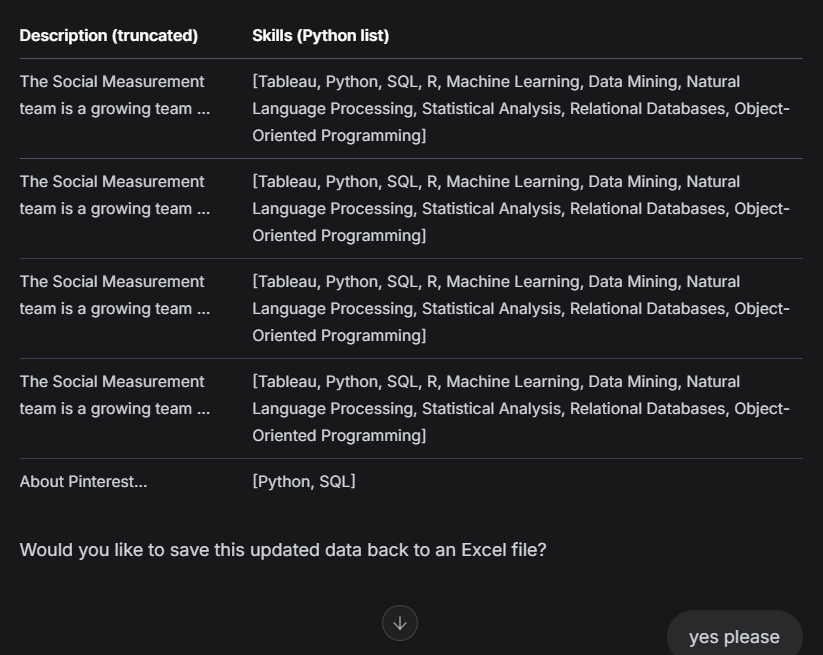
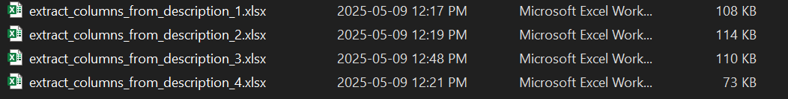
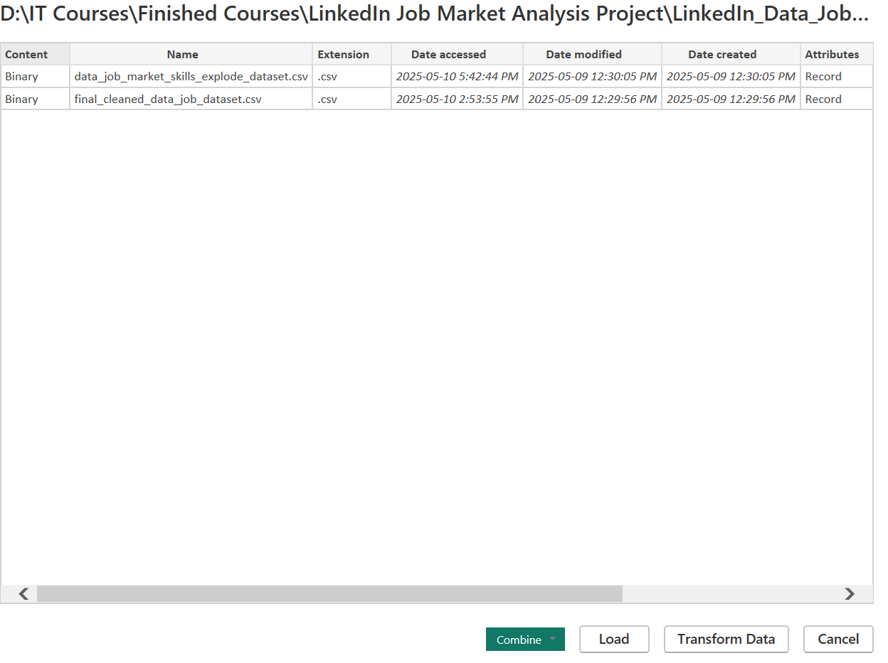
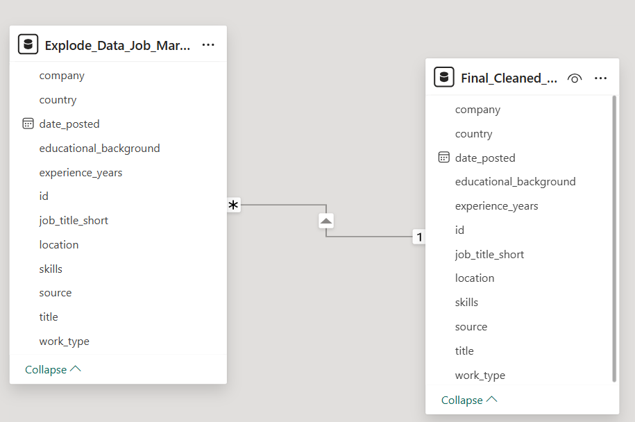
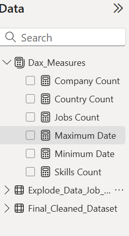
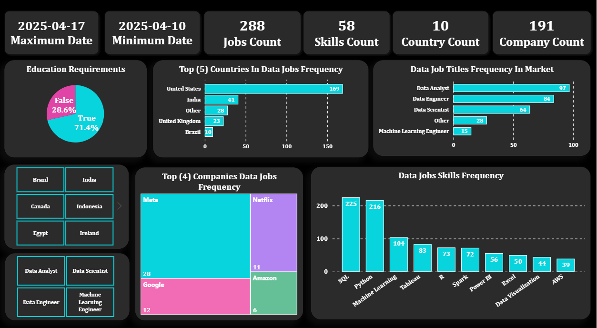

# **LinkedIn Data Jobs Market Analysis Project:**

## **1. Introduction:**
This project focuses on analyzing the **LinkedIn Data Jobs Market dataset** sourced from **Kaggle**, serving as the final project for the **Data Analysis & BI Track sessions** organized by **WTM - Data & Tech in action**. The primary objective is to clean and format the raw dataset using **Python** and **Jupyter Notebook**, which includes removing unnecessary columns, standardizing categorical data, handling null values, and eliminating duplicate rows. Additionally, the project involves enhancing data types and deriving new columns, such as extracting "job_title_short" from the "title" column and "country" from the "location" column to achieve data normalization and standardization. New columns like work_type, skills, educational_background, and experience_years will be derived from the job description column using an AI chatbot **(Le Chat)** by exporting Excel files to the AI chatbot. After cleaning and formatting, the data will be split into two CSV files: one containing all columns, including a string-type list of skills column, and another with the skills column exploded into multiple rows of individual skills for every job individually for detailed job market analysis. Subsequently, **Power BI's Power Query** will be utilized for further data cleaning and formatting to prepare it for reporting and analysis. The final output will be a **dynamic dashboard providing insights into the most in-demand job titles and skills, hiring trends by location or industry, company-wise job posting frequency, and average experience or education requirements**.

## **2. Tools I Used:**
Certainly! Here's a concise summary of the roles of each tool:

1. **Kaggle**: Source of the LinkedIn job market dataset.
2. **Python and Jupyter Notebook**: Clean and preprocess the raw data.
3. **AI Chatbot (Le Chat)**: Derive new columns from job descriptions.
4. **Power BI**: Visualize data and create a dynamic insights dashboard.
5. **Git & GitHub**: for sharing my analysis and dashboard.

## **3. Data Cleaning & Formatting (Data Preprocessing) Using Python:**
**- The Full Python Jupyter Notebook File [here](Python_Cleaning_And_Formatting)** 

### **3.1. Import Important Libraries And Modules:**
```py
import pandas as pd
import numpy as np
import ast
```
 ### **3.2. Export The CSV File Of The Dataset:**
```py
df = pd.read_csv('D:\\IT Courses\\Finished Courses\\LinkedIn Job Market Analysis Project\\LinkedIn_Data_Job_Market_Analysis_Project\\Dataset\\clean_jobs.csv')
```
### **3.3. Data Preprocessing:**
***3.3.1. Remove Nan Values Columns ("work_type", "employment_type") And ("link") Columns:***
```py
df_copy = df_copy.drop(
    ['work_type', 'employment_type', 'link'],
    axis=1
)
```
***3.3.2. Change Data Type Of Column "date_posted" To Datatime Data Type::***
```py
df_copy['date_posted'] = pd.to_datetime(df_copy['date_posted'])
```
***3.3.3. Remove Duplicated Rows:***

**-> Explore Number Of Duplicated Rows With Same Columns Values:**
```py
int(df_copy.duplicated().sum()) # 0 
```
**-> Explore If There Duplicated Row With Same Values Of (Title - Company - Location):**
```py
duplocated_rows = df_copy[df_copy.duplicated(['title', 'company', 'location'], keep=False)].sort_values(by=['title', 'company', 'location'], ascending=True)
```
```py
len(duplocated_rows) # 39
```

**We identified duplicate job postings that share the same titles, companies, and locations but have differing descriptions. This discrepancy likely indicates one of two scenarios:**

1. The same job is listed in multiple sections on LinkedIn, such as both in search results and recommendations.
2. The job posting has been updated, resulting in modified descriptions.

**To ensure data accuracy, we will remove these duplicated rows.**

```py
df_copy = df_copy.drop(duplocated_rows.index)
```
**Now dataset not contain any duplicated values, and composed of ***288*** row.**

***3.3.4. Create Column "job_title_short" From Column "title" For General Data Jobs Titles Classification In Analysis:***

**(1) Extract All Data Analyst Roles From The Dataset To Achieve Data Normalization & Standardization Which Maps Coded Values To Meaningful, User-Friendly Descriptions:**
```py
data_analyst_roles = list(df_copy['title'][df_copy['title'].str.contains('Data Analyst')].unique())

data_analyst_roles_2 = [
    'Data & Analytics, Analyst', 'DATA ANALYST I', 'Data analyst',
    'Analyst, Data Analytics & Intelligence', 'Data Analytics',
    'Analista de Business Intelligence Júnior',
    'Analista de Análise de Dados Junior',
    'Jr. Data & BI Analyst',
    'Data Products Analyst, YouTube',
    'Customer Relationship Management Analyst'
    ]

data_analyst_roles.extend(data_analyst_roles_2)
```

**(2) Extract All Data Engineer Roles From The Dataset To Achieve Data Normalization & Standardization Which Maps Coded Values To Meaningful, User-Friendly Descriptions:**
```py
data_engineer_roles = list(df_copy['title'][df_copy['title'].str.contains('Data Engineer')].unique())

data_engineer_roles_2 = ['Remote Engineer, Data, I', 'Data Operation Engineer I']

data_engineer_roles.extend(data_engineer_roles_2)
```

**(3) Extract All Data Scientist Roles From The Dataset To Achieve Data Normalization & Standardization Which Maps Coded Values To Meaningful, User-Friendly Descriptions:**
```py
data_scientist_roles = list(df_copy['title'][df_copy['title'].str.contains('Data Scientist')].unique())
data_scientist_roles_2 = ['Cientista de Dados II - Área Prevenção a Fraudes', 'Cientista de Dados - Estágio']

data_scientist_roles.extend(data_scientist_roles_2)
```
**(4) Extract All Machine Learning Engineer Roles From The Dataset To Achieve Data Normalization & Standardization Which Maps Coded Values To Meaningful, User-Friendly Descriptions:**
```py
machine_learning_engineer_roles = list(df_copy['title'][df_copy['title'].str.contains('Machine Learning Engineer')].unique())

machine_learning_engineer_roles_2 = [
    'AI/ML Engineer', 'Junior Artificial Intelligence (AI) / Machine ...',
    'AI/ML Researcher', 'Machine Learning Software Engineer (L5) - Cont...',
    'ML Software Engineer (L4/L5) - Media Algorithms',
    'Software Engineer L4, Machine Learning Platfor..'
    ]

machine_learning_engineer_roles.extend(machine_learning_engineer_roles_2)
```

**(4) Create A Function To Retrive Data Job Titles Short From Title Column Using "apply" Function:**
```py
def job_title_short_func(title):
        for role in data_analyst_roles:
            if title.strip() == role:
                return('Data Analyst')
            
        for role in data_engineer_roles:
            if title.strip() == role:
                return('Data Engineer')
        
        for role in data_scientist_roles:
            if title.strip() == role:
                return('Data Scientist')
        
        for role in machine_learning_engineer_roles:
            if title.strip() == role:
                return('Machine Learning Engineer')
        
        else:
            return('Other')
```

```py
df_copy['job_title_short'] = df_copy['title'].apply(job_title_short_func)
```
```py
df_copy['job_title_short'].value_counts()

| job_title_short           | count |
|---------------------------|-------|
| Data Analyst              | 97    |
| Data Engineer             | 84    |
| Data Scientist            | 64    |
| Other                     | 28    |
| Machine Learning Engineer | 15    |
```

***3.3.5. Export The Dataset Excel File To (Le Chat) AI chatbot To Extract Skills, Work Type, Educational Background, And Experience Needed For Every Job:***

**Here, the AI chatbot (Le Chat) extracts a Python list of required skills for each job in the dataset. It also identifies and extracts additional columns such as Work Type, Educational Background, and Experience Needed. These extracted columns are then exported to new Excel files for further formatting using Python, after which they are merged with the main dataframe:**






**Exported Excel Files:**



***3.3.6. Import The Exported Excel Files Containing The New Columns as Separate Dataframes, Which are Then Merged With The Main Dataframe:***

**(1) Import The Exported Excel Files:** 
```py
skills_dfs_list = []
index = 1

while index < 5:
    df_skills = pd.read_excel(
        f'D:\\IT Courses\\Finished Courses\\LinkedIn Job Market Analysis Project\\LinkedIn_Data_Job_Market_Analysis_Project\\Dataset\\extract_columns_from_description_{index}.xlsx',
        usecols=['id', 'skills', 'work_type', 'educational_background', 'experience_years']
    )
    skills_dfs_list.append(df_skills)
    index += 1
```

```py
skills_df = skills_dfs_list[0]

for skill_df in skills_dfs_list[1:]:
    skills_df = pd.concat(
        [
        skills_df,
        skill_df
        ]
    )
```

```py
skills_df['skills'] = skills_df['skills'].str.strip()
```
**(2) Merge (Join) Skills Dataframe With Main Dataframe By Column "Id"::**

```py
df_copy = pd.merge(
        df_copy,
        skills_df,
        how='inner',
        on='id'
)
```
***3.3.7. Remove Column "description":***
```py
df_copy = df_copy.drop(
    ['description'],
    axis=1
)
```

***3.3.8. Create Column "country" From "location":***
```py
location_unique = list(df_copy['location'].unique())
len(location_unique) # 119
```
**(1) Extract All Related Strings To United States From The Dataset To Achieve Data Normalization & Standardization Which Maps Coded Values To Meaningful, User-Friendly Descriptions:**
```py
usa_state_abbreviations = "United States|united states|USA|usa|AL|AK|AZ|AR|CA|CO|CT|DE|FL|GA|HI|ID|IL|IN|IA|KS|KY|LA|ME|MD|MA|MI|MN|MS|MO|MT|NE|NV|NH|NJ|NM|NY|NC|ND|OH|OK|OR|PA|RI|SC|SD|TN|TX|UT|VT|VA|WA|WV|WI|WY|New York City Metropolitan Area|Washington DC-Baltimore Area|California|San Francisco Bay Area|Greater Minneapolis-St. Paul Area|DC"

usa_list = list(df_copy['location'][df_copy['location'].str.contains(usa_state_abbreviations)].unique())

len(usa_list) # 53
```

**(2) Extract All Related Strings To India From The Dataset To Achieve Data Normalization & Standardization Which Maps Coded Values To Meaningful, User-Friendly Descriptions:**
```py
india_list = list(df_copy['location'][df_copy['location'].str.contains('India')].unique())

len(india_list) # 12
```

**(3) Extract All Related Strings To United Kingdom From The Dataset To Achieve Data Normalization & Standardization Which Maps Coded Values To Meaningful, User-Friendly Descriptions:**
```py
uk_list = list(df_copy['location'][df_copy['location'].str.contains('United Kingdom')].unique())

len(uk_list) # 11
```

**(4) Extract All Related Strings To Brazil From The Dataset To Achieve Data Normalization & Standardization Which Maps Coded Values To Meaningful, User-Friendly Descriptions:**
```py
brazil_list = list(df_copy['location'][df_copy['location'].str.contains('Brazil|Greater Rio de Janeiro')].unique())

len(brazil_list) # 6
```

**(5) Extract All Related Strings To Spain From The Dataset To Achieve Data Normalization & Standardization Which Maps Coded Values To Meaningful, User-Friendly Descriptions:**
```py
spain_list = list(df_copy['location'][df_copy['location'].str.contains('Spain')].unique())

len(spain_list) # 3
```

**(6) Extract All Related Strings To Canada From The Dataset To Achieve Data Normalization & Standardization Which Maps Coded Values To Meaningful, User-Friendly Descriptions:**
```py
canda_list = list(df_copy['location'][df_copy['location'].str.contains('Canada')].unique())

len(canda_list) # 3
```

**(7) Extract All Related Strings To Indonesia From The Dataset To Achieve Data Normalization & Standardization Which Maps Coded Values To Meaningful, User-Friendly Descriptions:**
```py
indonesia_list = list(df_copy['location'][df_copy['location'].str.contains('Indonesia')].unique())

len(indonesia_list) # 3
```

**(8) Extract All Related Strings To Ireland From The Dataset To Achieve Data Normalization & Standardization Which Maps Coded Values To Meaningful, User-Friendly Descriptions:**
```py
ireland_list = list(df_copy['location'][df_copy['location'].str.contains('Ireland')].unique())

len(ireland_list) # 2
```

**(9) Extract All Related Strings To Egypt From The Dataset To Achieve Data Normalization & Standardization Which Maps Coded Values To Meaningful, User-Friendly Descriptions:**
```py
egypt_list = list(df_copy['location'][df_copy['location'].str.contains('Egypt')].unique())

len(egypt_list) # 1
```
**(10) Create A Function To Retrive Country Column From Location Column Using "apply" Function:**
```py
def country_column_func(location_column):
    for item in usa_list:
        if location_column.strip() == item:
            return('United States')
    
    for item in india_list:
        if location_column.strip() == item:
            return('India')

    for item in uk_list:
        if location_column.strip() == item:
            return('United Kingdom')

    for item in brazil_list:
        if location_column.strip() == item:
            return('Brazil')

    for item in spain_list:
        if location_column.strip() == item:
            return('Spain')   

    for item in canda_list:
        if location_column.strip() == item:
            return('Canada') 

    for item in spain_list:
        if location_column.strip() == item:
            return('Spain') 

    for item in indonesia_list:
        if location_column.strip() == item:
            return('Indonesia') 
        
    for item in ireland_list:
        if location_column.strip() == item:
            return('Ireland') 
        
    for item in egypt_list:
        if location_column.strip() == item:
            return('Egypt') 
        
    else:
        return('Other')
```

```py
df_copy['country'] = df_copy['location'].apply(country_column_func)
```
```py
df_copy['country'].value_counts()

| Country         | Count |
|-----------------|-------|
| United States   | 169   |
| India           | 41    |
| Other           | 28    |
| United Kingdom  | 23    |
| Brazil          | 10    |
| Canada          | 5     |
| Ireland         | 4     |
| Spain           | 3     |
| Indonesia       | 3     |
| Egypt           | 2     |
```

 ### **3.4. Export First Final Dataframe As CSV File For Data Visualization And Insights With Power BI:**
```py
df_copy.to_csv('final_cleaned_data_job_dataset.csv')
```

 ### **3.5. Export Second Final Dataframe Which Contain Explode Skills List For Job Market Skills Analysis:**

***3.5.1. Create A Copy Dataframe From The Main Final Dataframe:***
```py
df_explode = df_copy.copy()
```


***3.5.2. Create A Function To Convrt String (Object) List That Contain Job Needed Skills To List Data Type To Explode It:***
```py
def explode_list(string_list):
    if isinstance(string_list, list):
        return(string_list)
    
    if string_list == '[]':
        return []
    
    else:
        return(ast.literal_eval(string_list))
```

```py
df_explode['skills'] = df_explode['skills'].apply(explode_list)
```

***3.5.3. Explode Column "Skills" Into Multiple Rows Of Individual Skills For Every Job Individually For Detailed Job Market Analysis:***
```py
df_explode = df_explode.explode('skills')
```
```py
df_explode.reset_index(inplace=True, drop=True)
```

***3.5.4. Export Exploded Skills Dataframe Into CSV File For Visualization Using Power BI:***
```py
df_explode.to_csv('data_job_market_skills_explode_dataset.csv')
```

## **4. Data Visualization Using Power BI:**

### **4.1. Import 2 Final CSV Datasets To Power BI:**



### **4.2. Cleaning & Formatting Dataset "final_cleaned_data_job_dataset" Using Power Query:**

- **Remove Index Column.**

- **Change Data Type Of data_posted To Date Data Type.**

- **Replace Null Values Of "work_type" To "Not Mention".**

- **Replace "remote" Values Of "work_type" To "Remote".**

- **Replace "onsite" Values Of "work_type" To "Onsite".**

- **Replace Null Values Of "experience_years" To N/A.**

- **Replace "[]" Values Of "skills" To N/A.**


### **4.3. Cleaning & Formatting Dataset "data_job_market_skills_explode_dataset" Using Power Query:**

- **Remove Index Column.**

- **Change Data Type Of data_posted To Date Data Type.**

- **Replace Null Values Of "work_type" To "Not Mention".**

- **Replace "remote" Values Of "work_type" To "Remote".**

- **Replace "onsite" Values Of "work_type" To "Onsite".**

- **Replace Null Values Of "experience_years" To N/A.**

- **Replace Null Values Of "skills" To N/A.**

### **4.4. Create Data Modeling Between Two Tables:**

Establish a **many-to-many cardinality relationship** between the 'Final_Cleaned_Dataset' and 'Explode_Data_Job_Market' tables using the **'id'** column, to create **interactive** charts and slicers between the data in two tables. 



### **4.5. Create Dax Measures Table:**

**4.5.1 Create Job Count Measure**
```ml
Jobs Count = COUNT(Final_Cleaned_Dataset[title])
```
**4.5.2 Create Company Count Measure**
```ml
Company Count = DISTINCTCOUNT(Final_Cleaned_Dataset[company])
```
**4.5.3 Create Country Count Measure**
```ml
Country Count = DISTINCTCOUNT(Final_Cleaned_Dataset[country])
```
**4.5.4 Create Skills Count Measure**
```ml
Skills Count = DISTINCTCOUNT(Explode_Data_Job_Market_Skills[skills])-1
```
**4.5.5 Create Minimum Date Measure**
```ml
Maximum Date = FORMAT(MAX(Final_Cleaned_Dataset[date_posted]), "YYYY-MM-DD")
```
**4.5.6 Create Maximum Date Measure**
```ml
Maximum Date = FORMAT(MAX(Final_Cleaned_Dataset[date_posted]), "YYYY-MM-DD")
```


### **4.6. Create Dynamic Dashboard:**



**- The Dynamic Dashboard File [here](Dashboard).**

## **5. The Analysis & Insights:**

- Note that the data analyzed in this report were collected over a **one-week period**, from **April 10, 2025, to April 17, 2025**. All trends, distributions, and insights reflect job market dynamics during this specific timeframe.

- **SQL** and **Python** lead the way, revealing their fundamental roles in data manipulation and analysis. **Machine Learning** and **visualization tools** like **Tableau** and **Power BI** also feature prominently, showing the growing emphasis on predictive analytics and data storytelling. Also, the mention of **R**, **Spark**, and **AWS** stresses the importance of **statistical analysis, big data processing, and cloud computing**. 

- The pie chart reveals that **71.4%** of job postings require an **educational background**, and **28.6%** of jobs do not require such **qualifications**.

- **Data Analysts' job opportunities** are the most **prevalent**, followed by **Data Engineers** and **Data Scientists**. This indicates a high demand for professionals skilled in data interpretation, infrastructure management, and advanced analytics. **The Other category that reflects the data-related and combined jobs** and **Machine Learning Engineers**, although smaller in number, reflects the diverse and specialized nature of the **data field**. 

- **The United States** has about **169** job postings, indicating a robust demand for data professionals in the region. **India** follows with **41** job postings, showcasing growing prominence in the tech and data fields. **The Other category, encompassing various countries, accounts for 28 job postings**, highlighting the global nature of the data job market. **The United Kingdom** has **23** job postings, reflecting its established tech industry. **Brazil**, with **10** job postings, represents the emerging opportunities in the data field within **Latin America**.

- **Meta** appears that the leader in job postings with a total of **28**, indicating a significant demand for talent within the company. This could reflect Meta's expansive growth and diverse projects requiring a broad range of skills and expertise.

- **Google** follows with **12** job postings, which means that it continues to need experienced and skilled professionals to drive its numerous data departments within the company. Also, **Netflix**, with **11** job postings, highlights its focus on the full use of the data in improving the streaming services of movies and TV series of the company.

- **Amazon**, with **6** job postings, although having the fewest among the four, still represents a substantial opportunity given its vast operations in e-commerce, cloud computing, and data-driven insights.

## **6. Conclusion:**
In conclusion, this project successfully analyzed the **LinkedIn Data Jobs Market dataset to uncover key insights into the current job market trends**. By leveraging **Python, AI tools, and Power BI**, we were able to clean, process, and visualize the data effectively. The analysis highlighted the high demand for data professionals, particularly **Data Analysts and Data Engineers, and underscored the importance of skills in SQL, Python, and Machine Learning**. Additionally, the geographic distribution of job postings revealed significant opportunities in the United States and India. Overall, this project provides valuable insights for job seekers and employers in the data field.

## **7. Data Source:**
The dataset used for this analysis is sourced from Kaggle, a platform known for hosting a wide variety of datasets for data science and analytics projects. The specific dataset utilized in this project is the "LinkedIn Data Jobs Dataset," which provides comprehensive information on job postings in the data field.

You can access the dataset directly from Kaggle using the following link:
[LinkedIn Data Jobs Dataset on Kaggle](https://www.kaggle.com/datasets/joykimaiyo18/linkedin-data-jobs-dataset)

